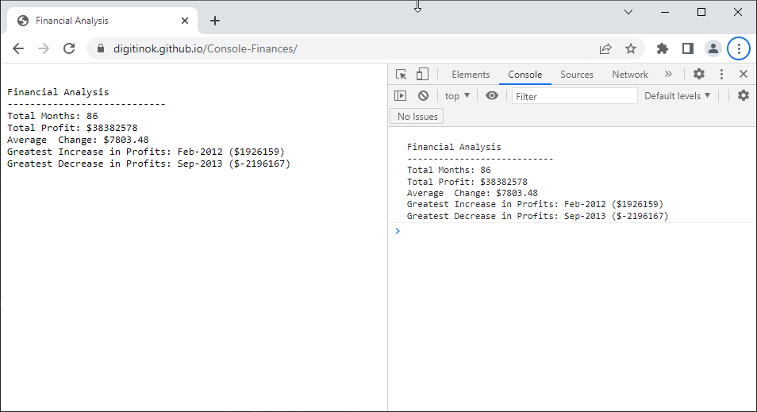

# Console Finances

The aim fo this project is to analyze the financial records of a company with JavaScript and display the results in the console.

### Repository

https://github.com/digitinok/Console-Finances

### Deployed Page

https://digitinok.github.io/Console-Finances/

## Installation

n/a

## Usage

The deployed page and the console will display the results of the financial analysis:

Screenshot of results

## Credits

N/A

## License

This project uses the MIT License. Please see the license file in the repositiry for fursther details.